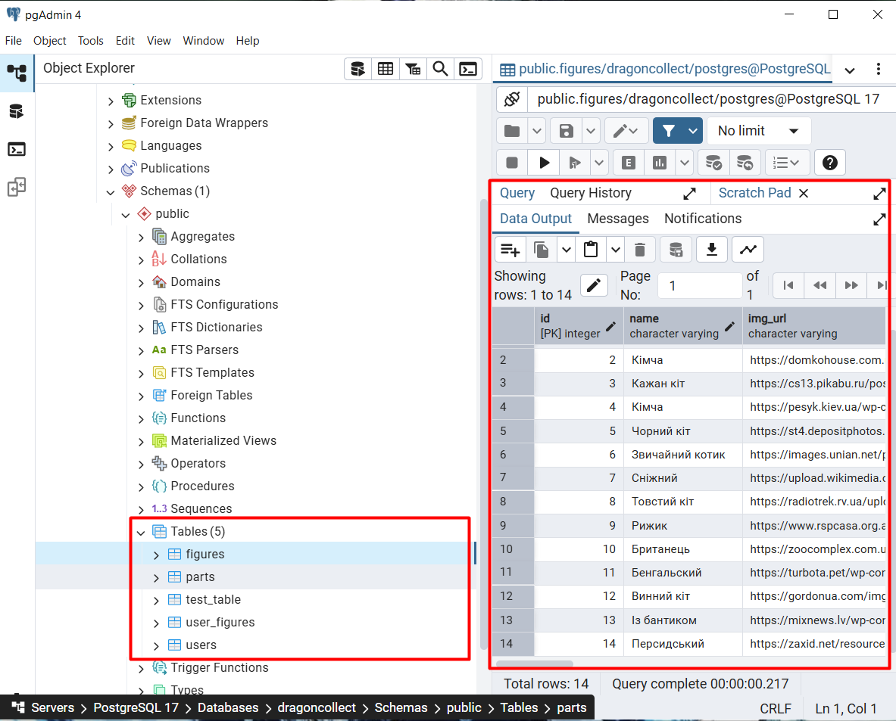
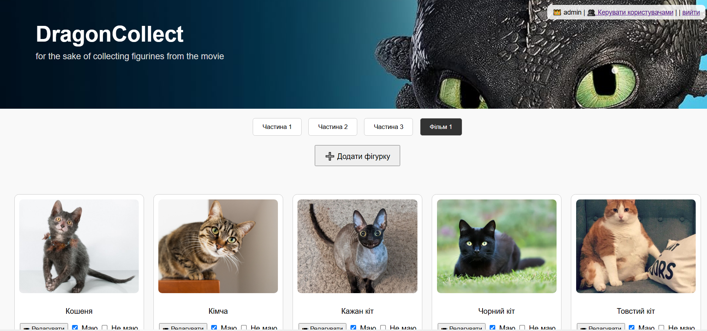
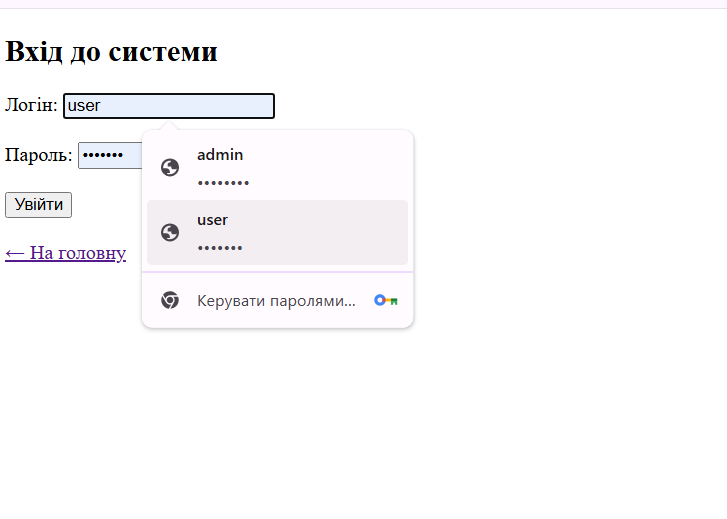
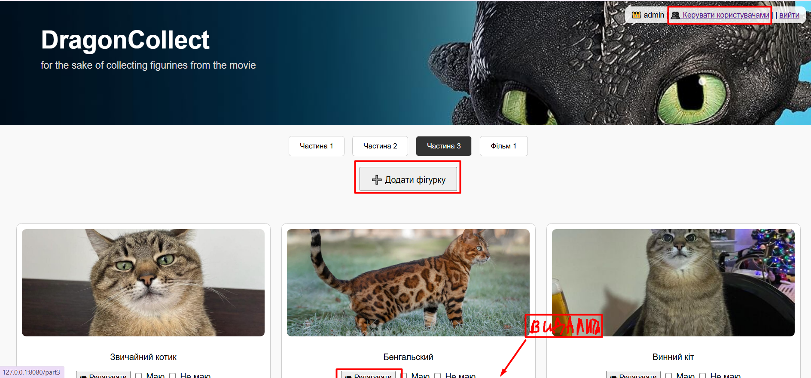
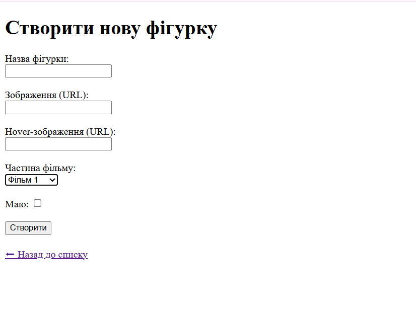
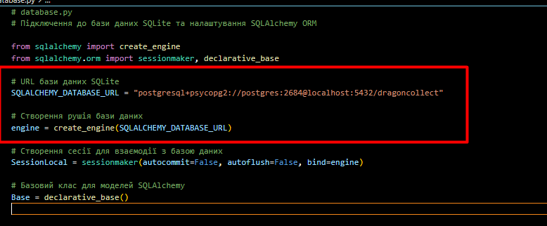
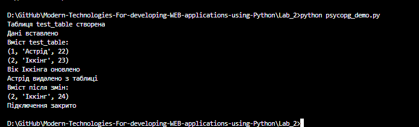
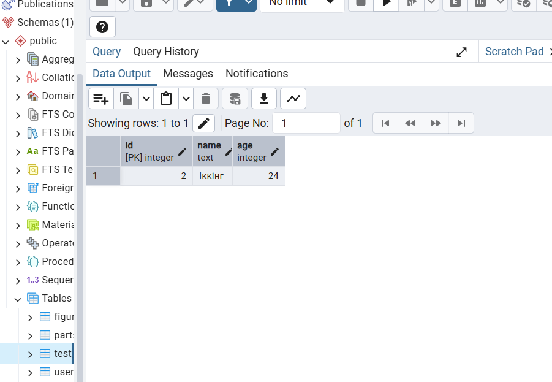

# DragonCollect — Каталог фігурок з мультфільму «Як приборкати дракона» (тимчасово з котиками)

## Доступ до акаунтів

- **Адміністратор**  
  Логін: `admin`  
  Пароль: `admin123`

- **Користувач**  
  Логін: `user1`  
  Пароль: `user234`

---

## Структура проєкту

```
├── main.py                  # головний файл FastAPI
├── models.py                # моделі SQLAlchemy
├── database.py              # конфігурація бази даних
├── templates/               # HTML-шаблони (Jinja2)
├── static/                  # стилі, зображення
├── migrate_sqlite_to_postgres.py  # скрипт переносу даних
├── psycopg_demo.py          # робота напряму з PostgreSQL через psycopg2
├── screenshots/             # скріншоти для звіту
└── README.md
```

---

## Як запустити

1. Встановити залежності:

```bash
pip install -r requirements.txt
```

2. Запустити сервер:

```bash
uvicorn main:app --reload --port 8080
```

3. Перейти на сторінку:  
[http://127.0.0.1:8080](http://127.0.0.1:8080)

---

## Виконання вимог лабораторної №2

### 1. Міграція даних на PostgreSQL

- Базу даних перенесено з `figurines.db` (SQLite) у PostgreSQL `dragoncollect`
- Збережено всі сутності:
  - `Figure`, `Part`, `User`, `UserFigure`


**Скріншоти:**
- `screenshots/pgAdmin4.png` — таблиці pgAdmin4

- `screenshots/home_page.png` — головна сторінка

- `screenshots/login_page.png` — авторизація

- `screenshots/admin_panel.png` — адмін-функції

- `screenshots/create_form.png` — додавання фігурки


---

### 2. Збереження всього функціоналу

- Усі сторінки `/`, `/part1`, `/create_form`, `/login`, тощо працюють без змін
- CRUD-операції збережено через SQLAlchemy

- `screenshots/sqlite_to_postgres_success.png`

---

### 3. Додавання роботи з psycopg2

- Створено окремий файл: `psycopg_demo.py`
- Реалізовано:
  - підключення
  - створення таблиці
  - вставка
  - вибірка
  - оновлення
  - видалення

**Скріншот:**  
`screenshots/psycopg_demo_result.png` — демонстрація роботи

`screenshots/psycopg_demo_result2.png` — демонстрація роботи


---


### 7. Робота напряму з PostgreSQL

Файл `psycopg_demo.py` доводить вміння працювати з PostgreSQL без ORM.

```python
conn = psycopg2.connect(
    dbname="dragoncollect",
    user="postgres",
    password="2684",
    host="127.0.0.1",
    port="5432"
)
...
```

---


## 📌 Висновок

Проєкт успішно перенесено на PostgreSQL.  
Використано і ORM (SQLAlchemy), і пряме підключення (psycopg2).  
Функціонал вебзастосунку збережено та розширено.

