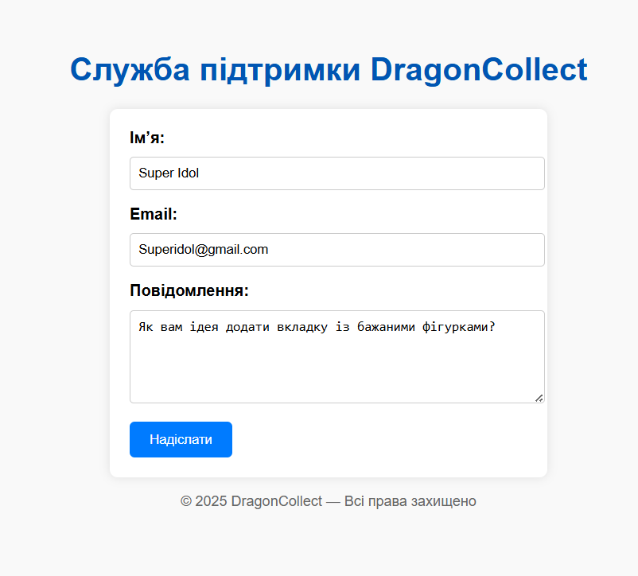
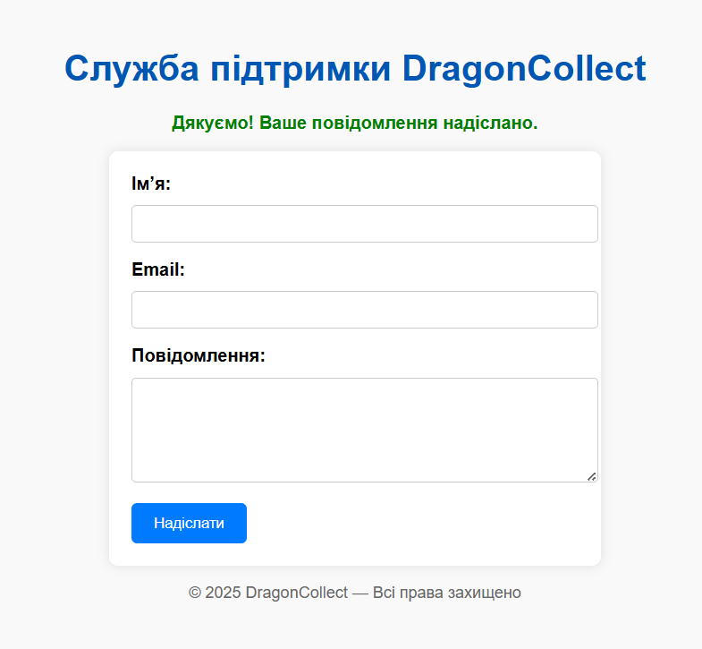
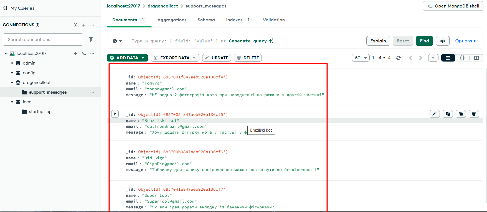
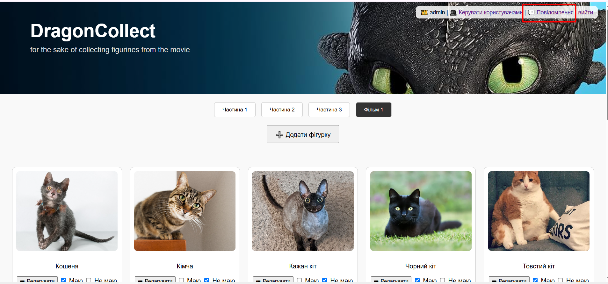
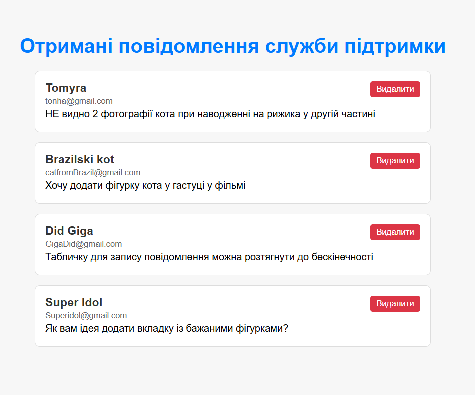
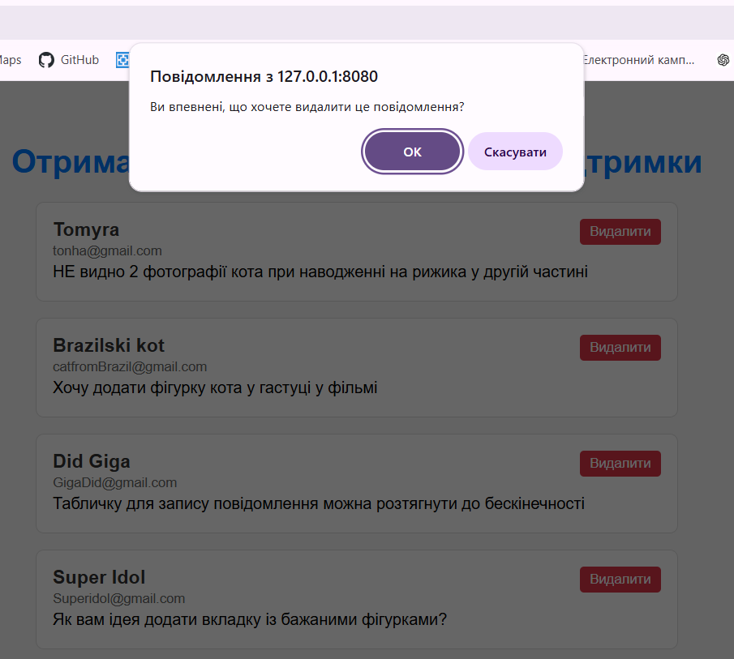

# DragonCollect — Каталог фігурок з мультфільму «Як приборкати дракона» (тимчасово з котиками)

## Доступ до акаунтів

- **Адміністратор**  
  Логін: `admin`  
  Пароль: `admin123`

- **Користувач**  
  Логін: `user1`  
  Пароль: `user234`

---


## Як запустити

1. Встановити залежності:

```bash
pip install -r requirements.txt
```

2. Запустити сервер:

```bash
uvicorn main:app --reload --port 8080
```

3. Перейти на сторінку:  
[http://127.0.0.1:8080](http://127.0.0.1:8080)

---

## Виконання вимог лабораторної №3


### 1. Підключено MongoDB

- Використано бібліотеку `pymongo`
- Підключення: `mongodb://localhost:27017`
- База: `dragoncollect`, колекція: `support_messages`

`screenshots/`mongodb.png` — `mongodb


---

### 2. Реалізовано форму підтримки

- Форма `support.html` дозволяє залишити ім’я, email та повідомлення
- Дані зберігаються в MongoDB

**Скріншоти:**
- `screenshots/support_form.png` — форма звернення


- `screenshots/support_form_correct.png` — успішне звернення


- `screenshots/mongodb_data.png` — збережені записи

---


### 3. Перегляд звернень (admin only)

- Новий маршрут: `/feedbacks`
- Доступ лише для адміністраторів
- Виводяться всі повідомлення з MongoDB

**Скріншоти:**

- `screenshots/message_admin.png` — місцезнаходження кнопки


- `screenshots/feedbacks_ok.png` — отримані повідомлення служби підтримки


---

### 4. Видалення повідомлень

- Адміністратор може видалити окреме повідомлення
- Перед видаленням з’являється підтвердження `confirm()`


**Скріншоти:**

- `screenshots/feedbacks_delete.png` — місцезнаходження кнопки


---


## 📌 Висновок

У цьому проєкті реалізовано комбінацію SQL (PostgreSQL + SQLAlchemy + psycopg2) та NoSQL (MongoDB + pymongo).

Базова функціональність збережена, додано підтримку звернень користувачів із формою та обробкою через MongoDB.