# DragonCollect — Каталог фігурок з мультфільму «Як приборкати дракона» (тимчасово з котиками)

## Доступ до акаунтів

- **Адміністратор**  
  Логін: `admin`  
  Пароль: `admin123`

- **Користувач**  
  Логін: `user1`  
  Пароль: `user234`

---


## Як запустити

1. Встановити залежності:

```bash
pip install -r requirements.txt
```

2. Запустити сервер:

```bash
uvicorn main:app --reload --port 8080
```

3. Перейти на сторінку:  
[http://127.0.0.1:8080](http://127.0.0.1:8080)

---

## Виконання вимог лабораторної №5

### 1. Створено базову Django-структуру

- Налаштовано `urls.py`, `views.py`, `models.py`, `templates/`
- Створено застосунок `figures` всередині проєкту
- Використано шаблонну систему Django

**Скріншот:**
- `screenshots/main_page.png` — головна сторінка з фігурками  
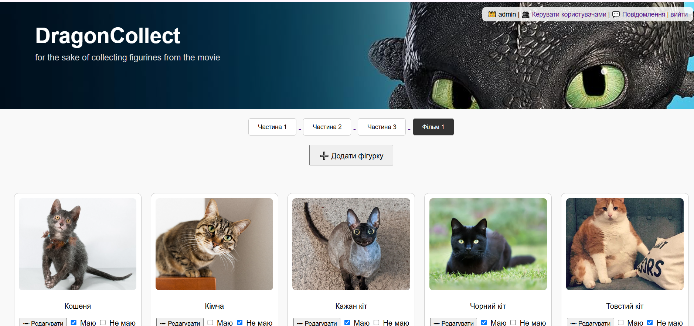

---

### 2. Реалізовано вивід даних з бази

- Всі фігурки виводяться з бази PostgreSQL через ORM
- Додано модель `Figure`, `Part`, `UserFigure`

**Скріншоти:**
- `screenshots/card_grid.png` — картки з фігурками  
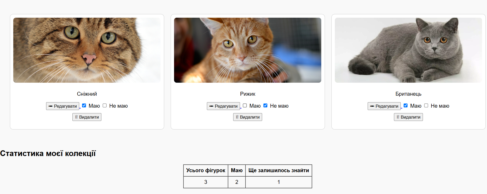

---

### 3. Підключено шаблони

- Всі сторінки оформлені за допомогою HTML-шаблонів у `templates/`
- Додано кастомні стилі, hover-ефекти та JavaScript
- Здійснено поділ логіки: **окрема в’юха для кожної сторінки**

**Скріншоти:**
- `screenshots/create_form.png` — форма створення фігурки 
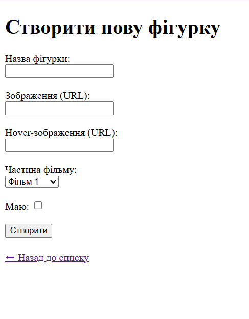 
- `screenshots/edit_form.png` — форма редагування фігурки
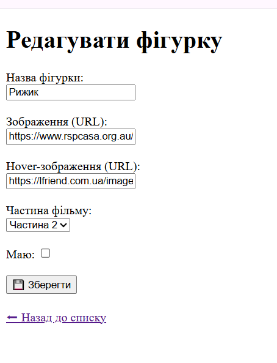

---

### 4. Реалізовано авторизацію

- Реєстрація, логін, логаут
- Права доступу: користувач може лише переглядати, адмін — редагувати

** Скріншот:**
- `screenshots/admin_login.png` — вхід в систему
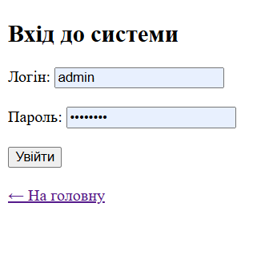  
- `screenshots/register_form.png` — форма реєстрації
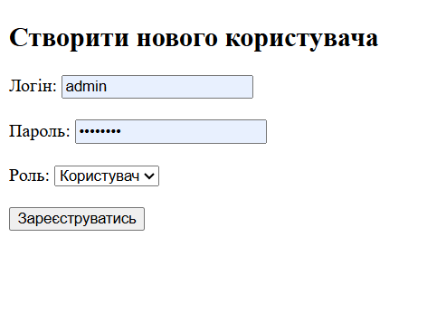

---

### 5. CRUD для фігурок (тільки для адміна)

- `/create_form` — створення нової фігурки
- `/edit/<id>` — редагування існуючої
- `/delete/<id>` — видалення з підтвердженням

** Скріншоти:**
- `screenshots/admin_controls.png` — кнопки “Створити”, “Редагувати”, “Видалити”
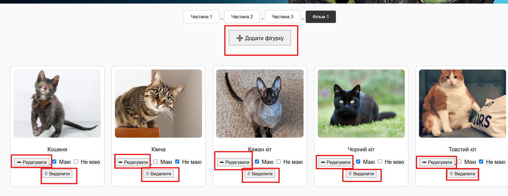

---

### 6. Власна колекція для кожного користувача

- Кожна фігурка має позначку: “Маю” / “Не маю”
- Дані зберігаються у таблиці `UserFigure`, окремо для кожного юзера

** Скріншот:**
- `screenshots/user_checkboxes.png` — позначки “маю / не маю”
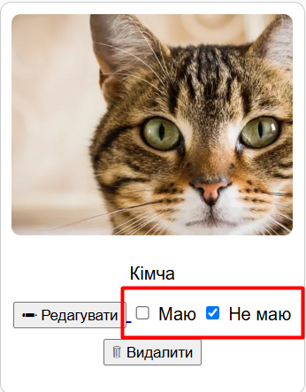
- `screenshots/stats_block.png` — статистика по зібраній колекції
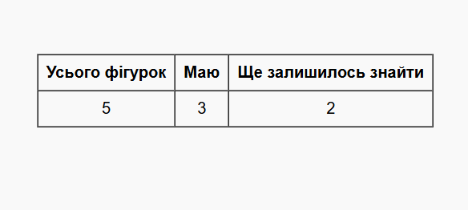

---

### 7. Сторінки About + Support

- `/about` з інформацією про проєкт
- `/support` — форма звернення
- `/feedbacks` — перегляд усіх звернень адміністратором

** Скріншот:**
- `screenshots/support.png` — форма звернення
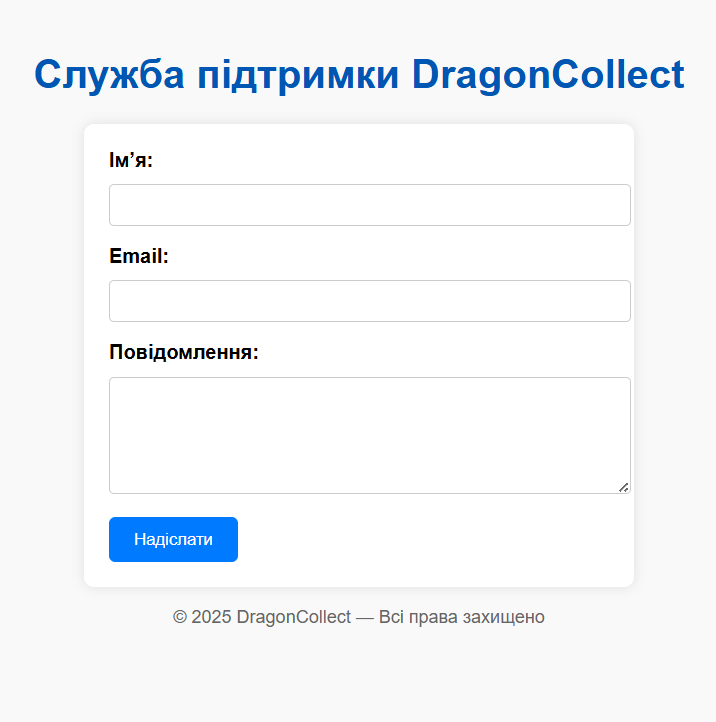
- `screenshots/feedbacks.png` — feedbacks
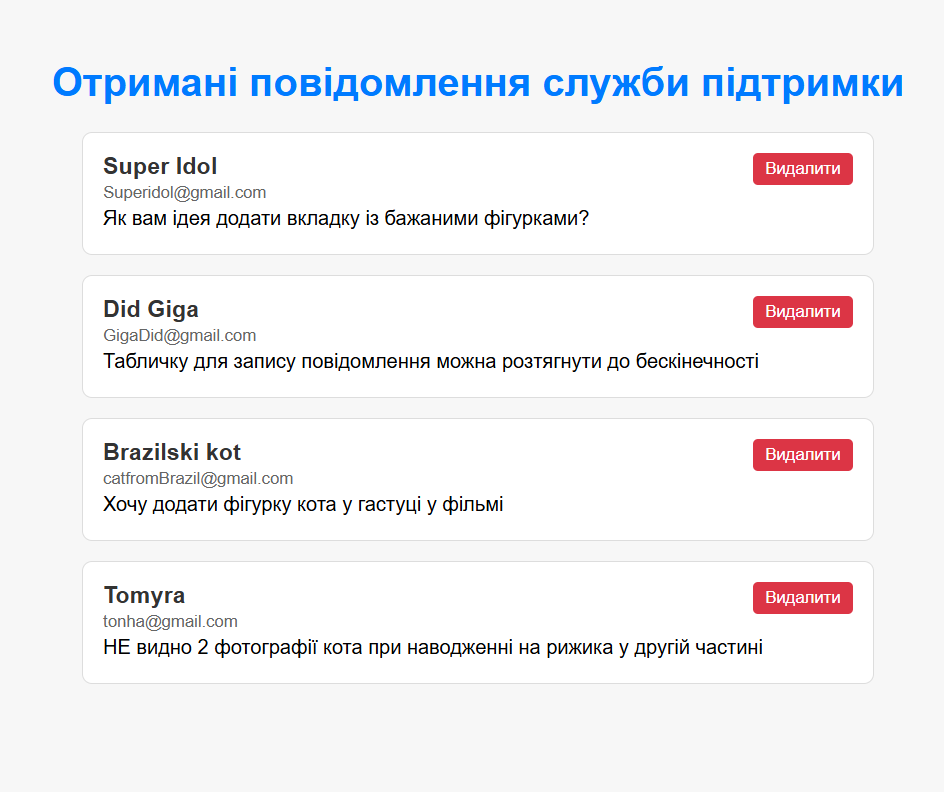

---

### 8. Індивідуальні дані для кожного юзера

- Функція "маю / не маю" реалізована через таблицю `UserFigure`
- Дані прив’язані до `request.user`
- Динамічна статистика: усього / маю / залишилось

** Скріншот:**
`screenshots/checkbox_stats.png` — функція "маю / не маю"  
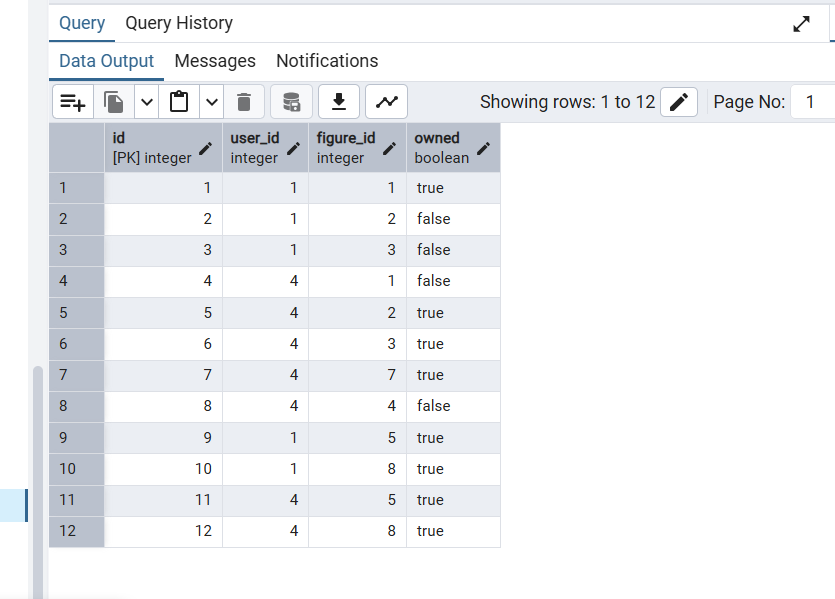

---

### 9. Авторизація та ролі

- Реалізовано поділ на:
  - **Адміністратор**: повний доступ (CRUD + керування юзерами)
  - **Користувач**: тільки перегляд + відмітка "маю / не маю"

** Скріншот:**
`screenshots/admin_pos.png` — керування користувачами  
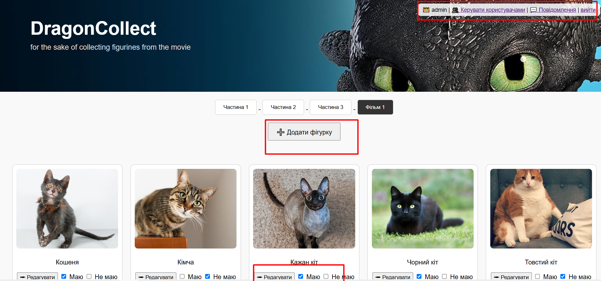
- `screenshots/user_pos.png` — керування адмінами
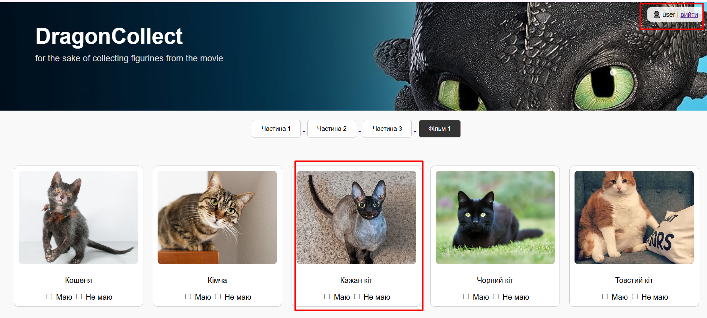


---

## Висновок

У ході лабораторної №5 реалізовано повноцінний вебзастосунок з використанням фреймворку Django. Забезпечено:
- Зв’язок з базою даних (PostgreSQL)
- Роботу з формами та валідацією
- CRUD-операції для фігурок
- Авторизацію та обмеження доступу
